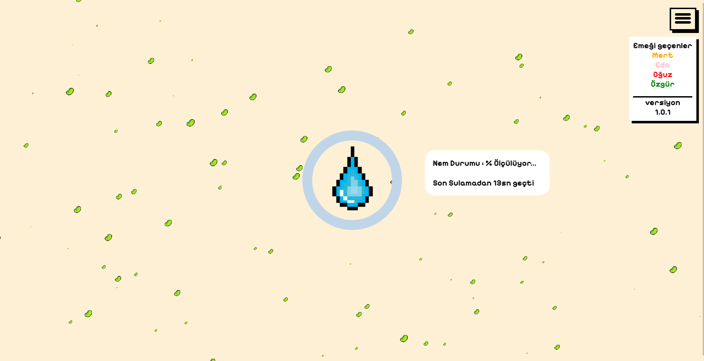
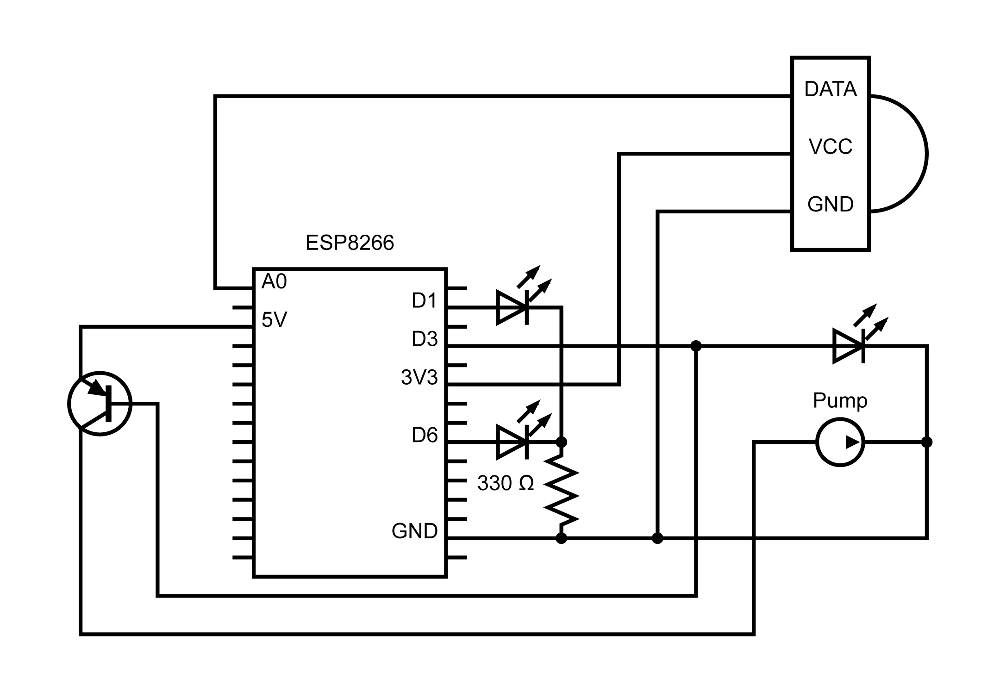

# Plant Irrigation Integration project for the final project
**Kayseri Üniversitesi BP. 2. Sınıf bitirme projesidir.**

Nodemcu ESP8266 veya Arduino Uno geliştirme kartı kullanılarak  
çeşitli sensörler ile toprağın nemini takip edip belli bir  
seviyenin altına düştüğünde otomatik sulayan sistem.  

## Kurulum aşaması
ESP8266 içerisine MicroPython yüklenmeli.  
`./src` içerisindeki dosyalar ESP8266 içerisine yüklenmeli.  

`wifi_creds.py` dosyası içerisine wifi bilgileri girilmeli.
```
WIFI_SSID = "wifi_ismi"
WIFI_PASSWORD = "wifi_sifresi"
```
`config.py` içerisindeki pin bağlantıları yapılmalı.

---
Web sitesi için gerekli olan paketler yüklenmeli.
```bash
npm install
```

`.env` dosyası içerisine port ESP8266'nın host ip bilgileri girilmeli.
```
API_URL=192.168.X.X
```
---

### Özellikler
* Web sitesi üstünden nem oranını takip edebilme
* Web sitesi üstünden isteğe bağlı sulama yapabilme
* LED'ler ile cihazın durumunu görebilme
* Otomatik sulama

### Görüntüler



### Kullanılan Teknolojiler
* MicroPython (ESP8266) **Embedded**
* NodeJS (Express) **Web**

### Ekip üyeleri
Grup başkanı [Mert Emir](https://github.com/mertemr)
* [Eda Keşoğlu](https://github.com/edakes)
* [Muhammed Nabi Oğuz](https://github.com/muhammed-ogz)
* [Haydar Özgür Mısırlı](https://github.com/Sadre321)
